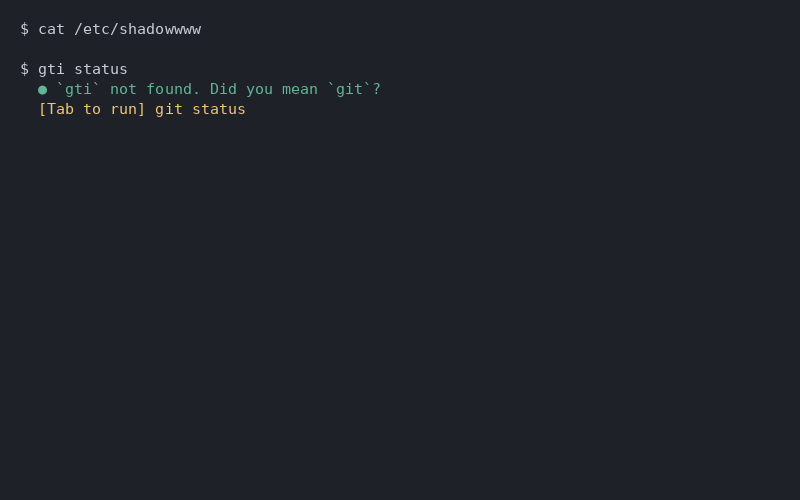

<div align="center">

# fixit

**Zero-dependency terminal error fixer. Works offline. Learns from you.**

Your shell fails. fixit knows why — and gets smarter every time you use it.

[](#demo)

</div>

---

## Why

```bash
$ gti status
gti: command not found
  ● `gti` not found. Did you mean `git`?
  [Tab to run] git status
```

No API keys. No telemetry. No AI server. Just a rule engine + your own history, running locally.

## Install

```bash
curl -sL https://raw.githubusercontent.com/puffachu/fixit/main/install.sh | bash
```

Or manually:

```bash
git clone https://github.com/puffachu/fixit.git ~/.local/share/fixit
echo 'source ~/.local/share/fixit/shell/fixit.bash' >> ~/.bashrc  # or .zshrc
source ~/.bashrc
```

## Demo

<!-- Record a GIF with asciinema/vhs and add here -->


**What it does:**

| Error | Suggestion |
|-------|-----------|
| Typo'd binary (`gti`, `pytohn`) | Fuzzy match against PATH (`git`, `python3`) |
| Wrong path in any command | Fuzzy-corrects against filesystem (`shadoww` → `gshadow`) |
| Permission denied | Suggests `sudo` (skips if already using it) |
| Port in use | Shows the PID and kill command |
| Git push rejected | `git pull --rebase && git push` |
| Docker not running | Start command for your OS |
| Missing npm/pip module | Install command |
| Chained commands (`&&`) | Identifies *which* part failed |
| …and more | See [`src/rules/index.js`](src/rules/index.js) |

## It learns

Every time you press **Tab** on a suggestion, fixit remembers. Next time you hit a similar failure, it recalls **your** fix first — before checking any rules.

```bash
$ nohup ../../bin/python bot/main.py &
  ● Based on your history:          ← purple = learned from YOU
  [Tab to run] nohup python3 bot/main.py &
```

History lives in `~/.fixit/history.json`. Delete it to start fresh.

## Config

Create `~/.fixit/config.json`:

```json
{
  "maxSuggestions": 3,
  "disabledRules": ["segfault"]
}
```

## How it works

```
Failed command → hook captures exit code + stderr + context
              → checks learned history first (your personal fixes)
              → then matches against 25+ built-in rules
              → best suggestion shown inline below prompt
              → [Tab] accepts and runs; otherwise ignored
```

- **Silent on success**: exit code `0` means nothing happens
- **Silent when unsure**: no confident match = no output
- **Never auto-executes**: suggestions wait for Tab

## Adding a rule

```js
{
  name: 'my-rule',
  match: ({ command, exitCode, output, context }) => {
    if (!output.includes('some pattern')) return null;
    return {
      message: 'Human-readable explanation',
      command: 'suggested --command',
      confidence: 0.9
    };
  }
}
```

`context` includes: `{ cwd, platform, isGitRepo, gitBranch, packageManager, ... }`

## Test

```bash
node test/engine.test.js   # 15 tests
node test/learn.test.js    # 6 tests
```

## License

MIT
